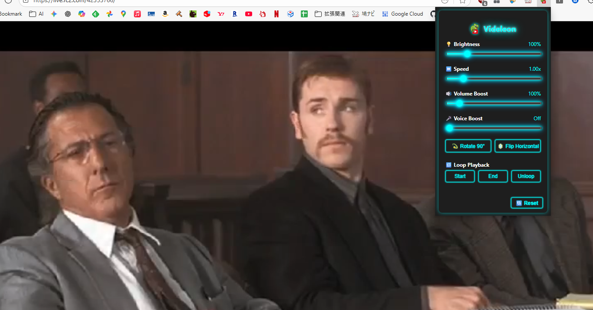

##   Videleon: Video Filter

**Videleon** is a versatile Chrome extension designed to enhance your viewing experience for any video (`<video>` element) in your browser. You can fully control every aspect of the video, including screen brightness, playback speed, volume, video rotation/flipping, and **loop playback** for a specified section.

---

## 💡 Key Features

| Category | Feature Name | Detail |
| :--- | :--- | :--- |
| **Video Adjustment** | **💡 Brightness** | Adjust the video's brightness in real-time. Useful for brightening dark scenes or dimming the screen. (0% to 500%) |
| **Playback Control** | **⏩ Playback Speed** | Fine-tune the video playback rate in small increments (0.05x). Convenient for speed listening or slow-motion viewing. (0.25x to 5.00x) |
| **Volume Enhancement** | **🔊 Volume Boost** | Boost the volume beyond the standard limit, up to a maximum of **500%**. Never miss small sounds. |
| **Audio Correction** | **🎤 Voice Boost** | Uses an equalizer (BiquadFilter) to emphasize the frequency range of human speech, making conversations clearer and easier to understand. |
| **Video Transformation** | **💫 90-Degree Rotation** | Rotates the video image in 90-degree steps. Corrects the orientation of videos shot vertically. |
| **Video Transformation** | **🪞 Horizontal Flip** | Flips the video image horizontally. Helpful for dance mirror practice or correcting spatial perception. |
| **Section Specification** | **🔁 Loop Playback** | By setting a **Start (Point A)** and **End (Point B)**, a specific video segment will automatically repeat. Ideal for practicing phrases or reviewing key moments repeatedly. |
| **Reset** | **🔄 Reset** | Instantly reverts all adjustments (brightness, speed, volume, rotation, loop) to their default values. |

---

## ⚙️ Control and Convenience

* **Intuitive UI:** The popup screen features a stylish design based on neon colors.
* **Mouse Wheel Operation:** Simply hover the cursor over a slider to **fine-tune the value using the mouse wheel**.
* **AudioContext Utilization:** Volume Boost and Voice Boost are implemented using the Web Audio API (**AudioContext**), providing high quality and flexible audio processing.
* **Multi-Language Support:** Internationalization (i18n) is supported via `__MSG_extName__` and `data-i18n` specifications.

Use Videleon to make your video viewing experience more comfortable and personal!
#

#   Videleon: Video Filter

**Videleon**は、あなたのブラウザ上のあらゆる動画（`<video>`要素）の視聴体験を向上させるための、多機能なChrome拡張機能です。画面の明るさ、再生速度、音量、さらには映像の回転・反転や、指定区間の**ループ再生**まで、動画のあらゆる側面を思い通りにコントロールできます。

 

## 💡 主要機能一覧

| カテゴリ | 機能名 | 詳細 |
| :--- | :--- | :--- |
| **映像調整** | **💡 明るさ (Brightness)** | 動画の明るさをリアルタイムで調整。暗いシーンを見やすくしたり、逆に画面を落としたりできます。（0%〜500%） |
| **再生制御** | **⏩ 再生速度 (Speed)** | 動画の再生速度を細かく（0.05刻みで）調整。速聴やスロー再生に便利です。（0.25x〜5.00x） |
| **音量強化** | **🔊 音量ブースト (Volume Boost)** | 標準音量を超えて、最大**500%**まで音量をブーストします。小さな音も聞き逃しません。 |
| **音質補正** | **🎤 ボイスブースト (Voice Boost)** | イコライザー（BiquadFilter）を用いて、人の話し声が集中する周波数帯域を強調し、会話を聞き取りやすくします。 |
| **映像変換** | **💫 90度回転** | 動画の映像を90度単位で回転させます。縦向きで撮影された動画などを正しい向きに直せます。 |
| **映像変換** | **🪞 左右反転** | 動画の映像を左右に反転させます。ダンスの鏡合わせ練習や、利き手補正などに役立ちます。 |
| **区間指定** | **🔁 ループ再生** | **Start (A地点)** と **End (B地点)** を指定することで、動画の特定区間を自動で繰り返し再生します。フレーズの練習や、重要な場面の反復確認に最適です。 |
| **リセット** | **🔄 リセット** | すべての調整値（明るさ、速度、音量、回転、ループ）を一瞬で初期値に戻します。 |

---

## ⚙️ コントロールの利便性

* **直感的なUI:** ポップアップ画面はネオンカラーを基調としたスタイリッシュなデザイン。
* **マウスホイール操作:** スライダーにカーソルを合わせるだけで、**マウスホイールで値を微調整**できます。
* **AudioContext利用:** 音量ブーストやボイスブーストは、ウェブオーディオAPI（AudioContext）を使用して実現しており、高い品質と柔軟な処理を提供します。
* **多言語対応:** `__MSG_extName__` や `data-i18n` の指定により、国際化（i18n）に対応しています。

Videleonで、あなたの動画視聴体験をより快適に、よりパーソナルなものにしましょう！